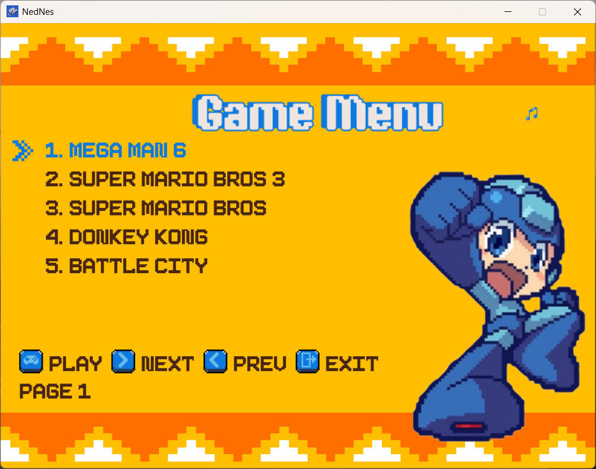
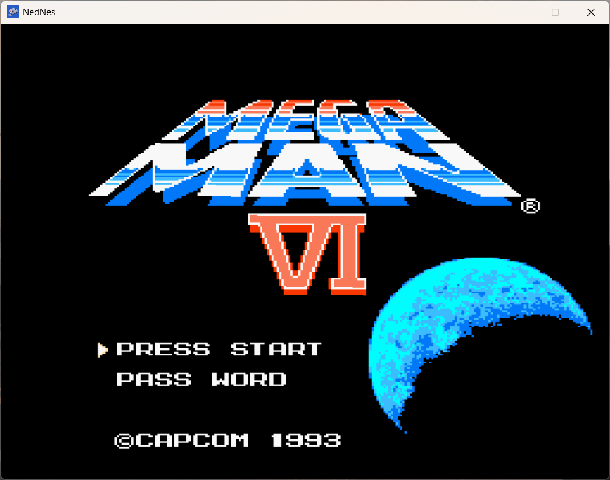
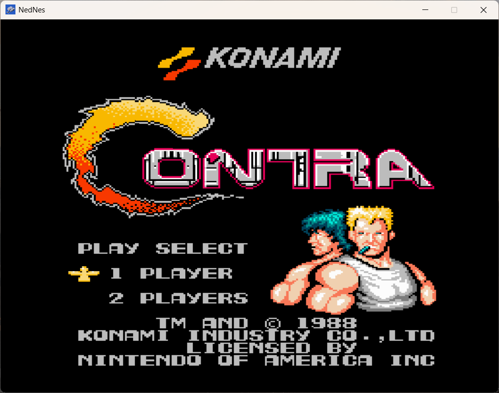
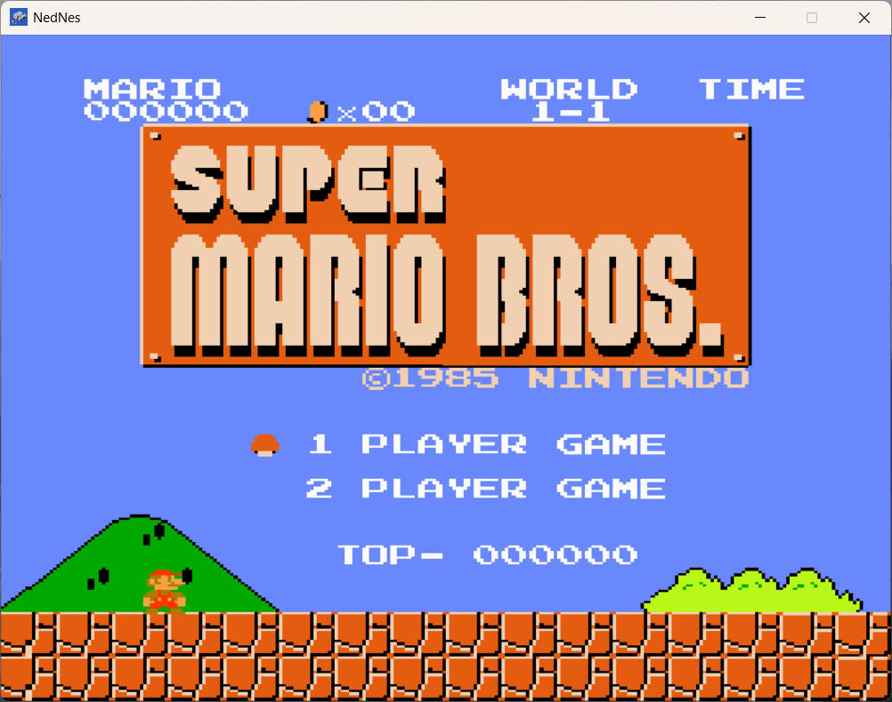
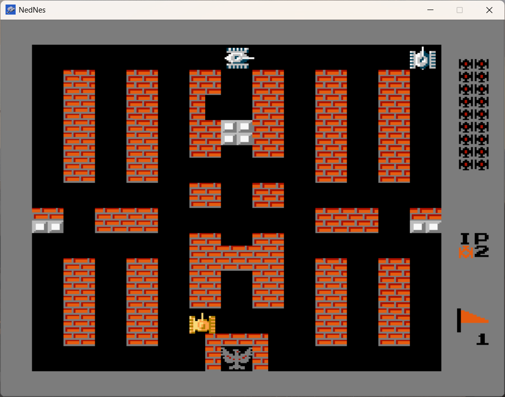
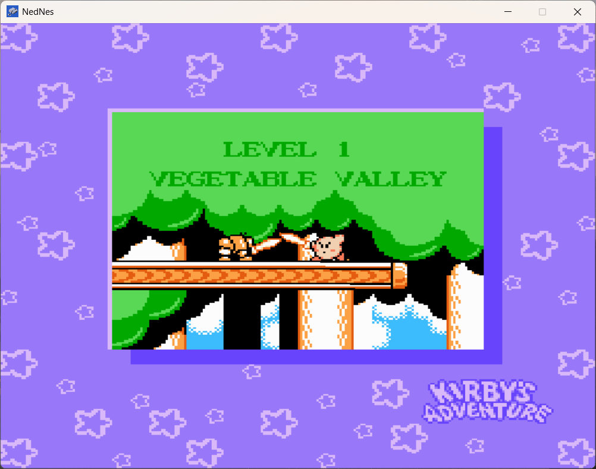

# **NEDNES**  
=================  

An **NES emulator** made in C++ to resemble the **Super VCD300**, a bootleg NES clone that was a staple of my childhood. This project is my way of paying homage to that system, which introduced me the wonder of video games :)  

It supports a large number of NES titles—around **50%-60% games**—including those that use **NROM** or **mappers 1-4**, which should run fine.  

---

## **Emulation Accuracy**  
> **Note:** The emulation is **not** cycle-accurate. Many shortcuts and hacks were taken to speed up development, so expect glitches, especially in games that rely heavily on frame-timing.  

---

## **Tested Games (But Not Limited To)**  

(Only tested with **USA/Japan/World versions**, i.e., **NTSC-compatible games**.)  

- **Super Mario Bros.**  
- **Contra**  
- **Adventure Island**  
- **Poyan**  
- **Mega Man 1-6**  
- **Super Mario Bros. 3**  
- **Kirby’s Adventure**  
- **Donkey Kong & Donkey Kong Jr.**  
- **Battle City**  
- **Paperboy**  
- **Karate**  
- **The Legend of Zelda**  
- **Final Fantasy**  
- **Pac-Man**  
- **Excitebike**  
- **Cabal**  
- **Battle City** *(Tested only with the Japanese version)*  
- **Jackal**  
- **And many more...**  

---


## **Audio Support**  
Currently, **only Pulse 1 and Pulse 2 channels are implemented**.
This means that some games may have incomplete or distorted audio since the NES audio processing unit (APU) also includes the **Triangle, Noise, and DPCM channels**, which are not yet emulated.  

> **Expected Issues:**  
> - Games that rely heavily on **triangle waves** (e.g., Mega Man, Zelda, or Metroid) will be missing key audio elements.  
> - **Sound effects using noise channels** (e.g., explosions or crashes) will not play.  
> - **PCM-based samples** (like drum beats in some games) will be absent.  


## **Legal Homebrew & Custom Games**  
While **NedNes** can play commercial NES ROMs, you should **only** run legally obtained games or homebrew titles. You can also create your own games using **homebrew development tools** and play them on the emulator.  


## **Screenshots**  







---

## **Video Showcase**  
------------  

<a href="https://youtu.be/FVenr2w3b3U">
    
</a>


---

## **Compiling**  
-----------  

### **Requirements**  
To build and run **NedNes**, you need the following dependencies:  

- **[SDL2 2.0+](#installing-sdl2)** development headers and libraries  
- **C++17-compliant compiler** (GCC, Clang, or MSVC)  
- **[CMake](https://cgold.readthedocs.io/en/latest/first-step/installation.html)** build system  

---

### **Compiling NedNes**  
Compiling **NedNes** is straightforward with CMake. Run CMake on the project directory with `CMAKE_BUILD_TYPE=Release`, and it will generate Makefiles (or the equivalent for your platform) to compile the emulator.  

#### **Example Compilation (Linux/macOS/FreeBSD)**  
```sh
git clone https://github.com/Eual11/NedNes.git
cd NedNes
mkdir build && cd build
cmake -DCMAKE_BUILD_TYPE=Release ..
make -j$(nproc)    # Replace $(nproc) with the number of CPU cores you want to use
```

#### **Example Compilation (Windows with MinGW)**
```sh
git clone https://github.com/Eual11/NedNes.git
cd NedNes
mkdir build && cd build
cmake -G "MinGW Makefiles" -DCMAKE_BUILD_TYPE=Release ..
mingw32-make -j4    # Replace 4 with however many cores you have
```
---

> **Note:** If you are on Windows, you can download the installer **[here](https://github.com/Eual11/NedNes-/releases/tag/v0.1alpha)**.  

---

### **Installing SDL2**  

#### **Windows**  
- Install via **vcpkg**:  
  ```sh
  vcpkg install sdl2 sdl2-ttf sdl2-image
  ```
- Alternatively, download from [SDL2's official site](https://github.com/libsdl-org/SDL/releases) and place the `.lib` and `.dll` files in the appropriate directories.  

#### **Linux (Debian/Ubuntu & derivatives)**  
```sh
sudo apt install -y libsdl2-dev libsdl2-ttf-dev libsdl2-image-dev
```

#### **Linux (Arch & derivatives)**  
```sh
sudo pacman -S sdl2 sdl2_ttf sdl2_image
```

#### **macOS**  
```sh
brew install sdl2 sdl2_ttf sdl2_image
```

---

### **Running NedNes**  
After compilation, you can run the emulator as follows:

**Linux/macOS:**  
```sh
./Release/NedNes
```

**Windows (MinGW/Visual Studio):**  
```sh
./Release/NedNes.exe
```

If you encounter missing DLL errors on Windows, copy the required **SDL2.dll**, **SDL2_ttf.dll**, and **SDL2_image.dll** into the build directory.  

---

## **Configuration**  

Nednes comes with only the **nestest** ROM. To play other games, add your own ROM files and update the configuration.  

### **Setting Up `config.ini`**  
1. Navigate to the **Nednes install folder**.  
2. Open the **`config`** folder.  
3. Edit the **`config.ini`** file (or create one if missing) and add them using this formats:  

```ini
[games]
Game 1 = ../roms/Game1.nes
Game 2 = ../roms/Game2.nes
Game 3 = ../roms/Game3.nes
# Add more games as needed

[settings]
mute = false
fps = 50
```


## **Controller Support**  
-----------------  

> **TODO: Configurable Keybinding**  

#### **Default Keybindings:**  

### **Player 1 (Keyboard)**  

| Button  | Mapped to  |  
|---------|-----------|  
| Start   | E         |  
| Select  | Q         |  
| A       | A         |  
| B       | D         |  
| Up      | Up        |  
| Down    | Down      |  
| Left    | Left      |  
| Right   | Right     |  

### **Player 1 (Gamepad)**  

| Button   | Mapped to  |  
|----------|-----------|  
| Start    | Start     |  
| Select   | Back      |  
| A        | A        |  
| B        | B        |  
| Up       | D-Pad Up  |  
| Down     | D-Pad Down|  
| Left     | D-Pad Left|  
| Right    | D-Pad Right|  


---

### **Game Selection Controls**

- **N** - Move to the **next page** in the game selection list.
- **P** - Move to the **previous page** in the game selection list.
- **M** - Mute Audio
- **Enter** - **Start the game** selected.
- **Esc** - **Exit** back to the game selection screen.
-

--- 


### **Note:**  
- **Player 2 can be enabled by plugging in a second controller.**  
- Keybindings can be customized in future updates.  

---

## **Troubleshooting**  

### **1. SDL2 Not Found**  
If SDL2 is not detected, set the include path manually:  
```sh
export CPLUS_INCLUDE_PATH=/path/to/SDL2/include
```
Or specify it when running CMake:  
```sh
cmake -DSDL2_DIR=/path/to/SDL2 ..
```

### **2. Compilation Fails on Windows (MSVC)**  
Ensure you're using the correct compiler and have installed the necessary dependencies via **Visual Studio Installer**.
